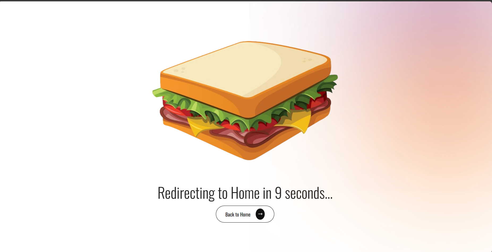

# MERN-RESTAURANT

Simple interface for restaurant reservations 

## Overview

Here create the backend using Nodejs + MongoDb to create simple Restfull APIs. Then the interface uses React to get those APIs displayed on the web and then posts the reservation back to the backend and then saves it to the database.
The purpose is to learn how a backend and frontend handle each other. 

 
    
    
    
    
    
    
    
    
    

